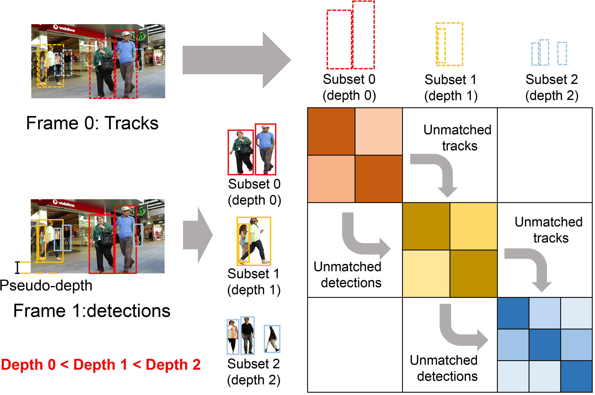

<div align="center">
<h1>SparseTrack:  
<h3>Multi-Object Tracking by Performing Scene Decomposition based on Pseudo-Depth</h3>

<!-- [Bencheng Liao](https://github.com/LegendBC)<sup>1,2,3</sup> \*, [Shaoyu Chen](https://scholar.google.com/citations?user=PIeNN2gAAAAJ&hl=en&oi=sra)<sup>1,3</sup> \*, [Xinggang Wang](https://xinggangw.info/)<sup>1 :email:</sup>, [Tianheng Cheng](https://scholar.google.com/citations?user=PH8rJHYAAAAJ&hl=zh-CN)<sup>1,3</sup>, [Qian Zhang](https://scholar.google.com/citations?user=pCY-bikAAAAJ&hl=zh-CN)<sup>3</sup>, [Wenyu Liu](http://eic.hust.edu.cn/professor/liuwenyu/)<sup>1</sup>, [Chang Huang](https://scholar.google.com/citations?user=IyyEKyIAAAAJ&hl=zh-CN)<sup>3</sup>
 
<sup>1</sup> School of EIC, HUST, <sup>2</sup> Institute of Artificial Intelligence, HUST, <sup>3</sup> Horizon Robotics -->

<!-- (\*) equal contribution, (<sup>:email:</sup>) corresponding author. -->

<!-- ArXiv Preprint ([arXiv 2208.14437](https://arxiv.org/abs/2208.14437)) -->

<!-- [openreview ICLR'23](https://openreview.net/forum?id=k7p_YAO7yE), accepted as **ICLR Spotlight** -->

</div>


## News


## Abstract
####  SparseTrack is a simply and strong multi-object tracker. 
 
<p align="center"></p> 

Exploring robust and efficient association methods has always been an important issue in multiple-object tracking (MOT).
Although existing tracking methods have achieved impressive performance, congestion and frequent occlusions still pose challenging problems in multi-object tracking. 
We reveal that performing sparse decomposition on dense scenes is a crucial step to enhance the performance of associating occluded targets. 
To this end, we propose a pseudo-depth estimation method for obtaining the relative depth of targets from 2D images.  
Secondly, we design a depth cascading matching (DCM) algorithm, which can use the obtained depth information to convert a dense target set into multiple sparse target subsets and perform data association on these sparse target subsets in order from near to far. 
By integrating the pseudo-depth method and the DCM strategy into the data association process, we propose a new tracker, called SparseTrack. 
SparseTrack provides a new perspective for solving the challenging crowded scene MOT problem and achieves comparable performance with state-of-the-art (SOTA) on the MOT17 and MOT20 test set.

## Tracking performance
### Results on MOT challenge test set
| Dataset    | HOTA | MOTA | IDF1 | MT | ML | FP | FN | IDs |
|------------|-------|-------|------|------|-------|-------|------|------|
|MOT17       | 65.1 | 81.0 | 80.1 | 54.6% | 14.3% | 23904 | 81927 | 1170 |
|MOT20       | 63.4 | 78.2 | 77.3 | 69.9% | 9.2%  | 25108 | 86720 | 1116 |

**Notes**: 
- All the experiments are performed on NVIDIA GeForce RTX 3090 GPUs. 
- All implementations use the same detector and model weights as [ByteTrack](https://github.com/ifzhang/ByteTrack) . 
- SparseTrack relies on IoU distance association only and do not use any appearance embedding, learnable motion, and attention components.
 
## Installation
<!-- - [Installation](docs/install.md)
- [Prepare Dataset](docs/prepare_dataset.md)
- [Train and Eval](docs/train_eval.md)
- [Visualization](docs/visualization.md) -->


## Data preparation
<!-- 
- [ ] centerline detection & topology support
- [x] multi-modal checkpoints
- [x] multi-modal code
- [ ] lidar modality code
- [x] argoverse2 dataset 
- [x] Nuscenes dataset 
- [x] MapTR checkpoints
- [x] MapTR code
- [x] Initialization -->

## Model zoo
 
## Training

## Tracking
 
## Demo
 
## Acknowledgements

A large part of the code is borrowed from YOLOX, FairMOT, ByteTrack. Many thanks for their wonderful works.

<!-- ## Citation -->
<!-- If you find MapTR is useful in your research or applications, please consider giving us a star 🌟 and citing it by the following BibTeX entry.
```bibtex
@inproceedings{MapTR,
  title={MapTR: Structured Modeling and Learning for Online Vectorized HD Map Construction},
  author={Liao, Bencheng and Chen, Shaoyu and Wang, Xinggang and Cheng, Tianheng, and Zhang, Qian and Liu, Wenyu and Huang, Chang},
  booktitle={International Conference on Learning Representations},
  year={2023}
} -->
```
